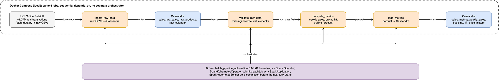

# Retail Sales Pipeline

Batch pipeline for retail sales analytics: ingest raw sales data, validate it, compute sales metrics, and load the results back into Cassandra. Runs on Docker Compose locally, or on Kubernetes with Airflow orchestration.

[](https://github.com/nader-hachana/retail-sales-pipeline/actions/workflows/ci.yml)



## Data

[UCI Online Retail II](https://archive.ics.uci.edu/dataset/502/online+retail+ii): about 1.07M real transactions from a UK-based online retailer.

## Tech stack

Scala, Spark, Cassandra, Airflow, Docker, Kubernetes, Helm

## Pipeline

Four Spark jobs, run in sequence:

1. **ingest_raw_data**: loads the raw CSVs (sales, products, calendar) into Cassandra.
2. **validate_raw_data**: checks each table for missing or incorrect values.
3. **compute_metrics**: computes weekly sales, promo lift, and a trailing sales forecast.
4. **load_metrics**: writes the computed metrics back into Cassandra.

## Run it

### Docker Compose

```bash
python3 scripts/fetch_data.py
docker compose up --build
```

Check the results:

```bash
docker exec bpa-cassandra cqlsh -e "SELECT * FROM sales_metrics.weekly_sales LIMIT 5"
```

### Kubernetes

The same pipeline, orchestrated by Airflow on Kubernetes via the [Spark Operator](https://github.com/kubeflow/spark-operator). Needs `kind`, `helm`, and `kubectl`.

```bash
kind create cluster --config k8s/kind-config.yaml --name bpa
kubectl create namespace airflow
helm install spark-operator ./k8s/helm/spark-operator --namespace airflow

kubectl apply -f k8s/manifests/cassandra.yml
kubectl apply -f k8s/manifests/volumes.yml
kubectl create configmap cassandra-schema --from-file=schema.cql=infra/cassandra/schema.cql --namespace airflow
kubectl apply -f k8s/manifests/cassandra-schema-init-job.yml

python3 scripts/fetch_data.py
for job in ingest_raw_data validate_raw_data compute_metrics load_metrics; do
  docker build -t ${job}:latest ./jobs/${job}
  kind load docker-image ${job}:latest --name bpa
done
docker build -t airflow:1.0 -f k8s/Dockerfile .
kind load docker-image airflow:1.0 --name bpa

helm install airflow ./k8s/helm/airflow --namespace airflow \
  -f k8s/airflow-local-values.yaml \
  --set postgresql.image.repository=bitnamilegacy/postgresql
kubectl apply -f k8s/manifests/airflow-spark-rbac.yml
kubectl -n airflow exec deploy/airflow-scheduler -c scheduler -- \
  airflow connections add kubernetes_default --conn-type kubernetes --conn-extra '{"in_cluster": true}'

kubectl -n airflow exec deploy/airflow-scheduler -c scheduler -- \
  airflow dags unpause batch_pipeline_automation
kubectl -n airflow exec deploy/airflow-scheduler -c scheduler -- \
  airflow dags trigger batch_pipeline_automation
```

Watch it run:

```bash
kubectl -n airflow get sparkapplications -w
```

## Tests

```bash
sbt test
```

## Layout

```
jobs/
  common/              shared Spark session + Cassandra helpers
  ingest_raw_data/     raw CSVs -> Cassandra
  validate_raw_data/   data quality checks
  compute_metrics/     the actual metrics
  load_metrics/        parquet -> Cassandra
infra/cassandra/       schema.cql, the single source of truth for the schema
airflow/dags/          the Airflow DAG
k8s/                   Helm charts, manifests, and the local KinD setup
scripts/fetch_data.py  downloads and reshapes the real dataset
```
